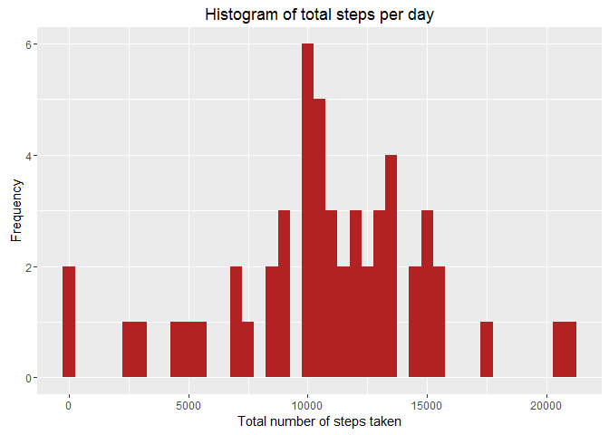
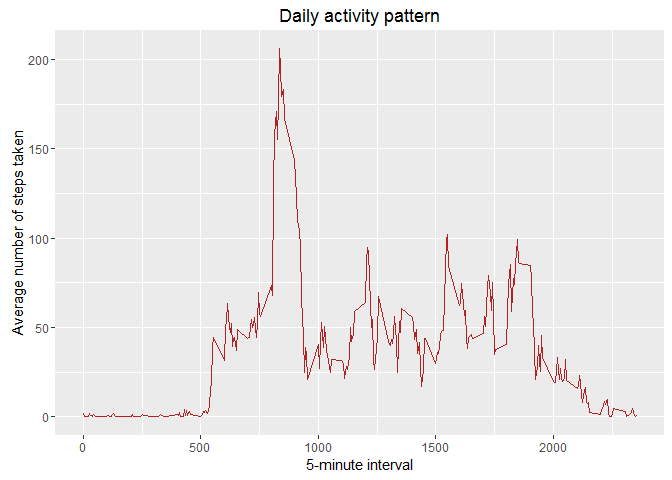
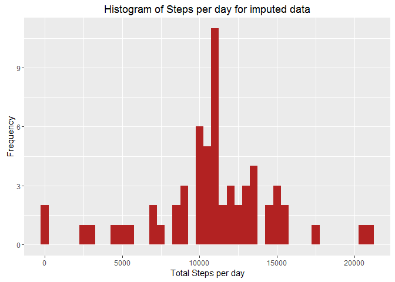
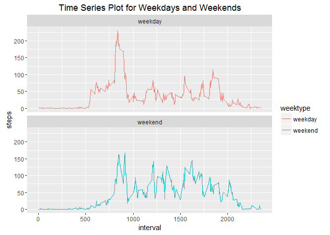

# Reproducible Research: Peer Assessment 1

#### Introduction

This assignment makes use of data from a personal activity monitoring device. This device collects data at 5 minute intervals through out the day. The data consists of two months of data from an anonymous individual collected during the months of October and November, 2012 and include the number of steps taken in 5 minute intervals each day.

This document contains R code for analyzing the given data set for answering the assignment questions. The "echo = TRUE" is turned on for this document to make the R code visible

#### Library Packages

Load the libraries  required for this assignment


```r
library(knitr)
library(dplyr)
```

```
## 
## Attaching package: 'dplyr'
```

```
## The following objects are masked from 'package:stats':
## 
##     filter, lag
```

```
## The following objects are masked from 'package:base':
## 
##     intersect, setdiff, setequal, union
```

```r
library(ggplot2)
library(lubridate)
```

```
## Warning: package 'lubridate' was built under R version 3.2.5
```

```
## 
## Attaching package: 'lubridate'
```

```
## The following object is masked from 'package:base':
## 
##     date
```


#### Loading and preprocessing the data


```r
    ## Create data and plots directories to download data and plots.
    datadir <- "./data"
    if (! file.exists(datadir)) {
        dir.create(datadir) 
    }
    
    plotsdir <- "./plots"
    if (! file.exists(plotsdir)) {
        dir.create(plotsdir) 
    }

    
    ## Unzip assignment data to data directory
    ## It is assumed that the file is already present in the current directory. If not 
    ## download it.
    unzip("activity.zip", exdir = datadir)
    
    ## Read the data 
    activityData <- read.csv("data/activity.csv")
    
    ## Tidy the data by changing the date format from character to actual dates
    activityData$date <- ymd(activityData$date)
```
#### Question 1: What is mean total number of steps taken per day after ignoring the missing values in the dataset.

Sub Query 1 : Calculate the total number of steps taken per day

```r
    sumData <- activityData %>%
        filter(!is.na(steps)) %>%
        group_by(date) %>%
        summarize(steps = sum(steps))

    str(sumData)
```

```
## Classes 'tbl_df', 'tbl' and 'data.frame':	53 obs. of  2 variables:
##  $ date : Date, format: "2012-10-02" "2012-10-03" ...
##  $ steps: int  126 11352 12116 13294 15420 11015 12811 9900 10304 17382 ...
```

```r
    head(sumData)
```

```
## Source: local data frame [6 x 2]
## 
##         date steps
##       (date) (int)
## 1 2012-10-02   126
## 2 2012-10-03 11352
## 3 2012-10-04 12116
## 4 2012-10-05 13294
## 5 2012-10-06 15420
## 6 2012-10-07 11015
```

Sub Query 2: Make a histogram of the total number of steps taken each day


```r
    plot1 <- ggplot(sumData, aes(x = sumData$steps)) +
        geom_histogram(fill = "firebrick", binwidth = 500) +
        xlab("Total number of steps taken") +
        ylab("Frequency") +
        ggtitle("Histogram of total steps per day")
    
    print(plot1)
```

<!-- -->

Sub Query 3:  Calculate and report the mean and median of the total number of steps taken per day

Mean of total number of steps is

```r
    meanVal <- mean(na.omit(sumData$steps))
    meanVal
```

```
## [1] 10766.19
```
Median of total number of steps is

```r
    medianVal <- median(na.omit(sumData$steps))
    medianVal
```

```
## [1] 10765
```

#### Question 2: What is the average daily activity pattern?

Sub Query 1: Make a time series plot (i.e. type = "l") of the 5-minute interval (x-axis) and the average number of steps taken, averaged across all days (y-axis)


```r
    averageStepsPerTimeBlock <-
        aggregate(steps ~ interval, activityData, mean)

    str(averageStepsPerTimeBlock)
```

```
## 'data.frame':	288 obs. of  2 variables:
##  $ interval: int  0 5 10 15 20 25 30 35 40 45 ...
##  $ steps   : num  1.717 0.3396 0.1321 0.1509 0.0755 ...
```

```r
    head(averageStepsPerTimeBlock)
```

```
##   interval     steps
## 1        0 1.7169811
## 2        5 0.3396226
## 3       10 0.1320755
## 4       15 0.1509434
## 5       20 0.0754717
## 6       25 2.0943396
```

```r
    plot2 <- ggplot(data = averageStepsPerTimeBlock, aes(x = interval, y = steps)) +
        geom_line(colour = 'firebrick', linetype = 1) +
        xlab("5-minute interval") +
        ylab("Average number of steps taken") +
        ggtitle("Daily activity pattern")
    
    print(plot2)
```

<!-- -->

On an average the number of steps seems to be peeking up in the morning and tapering off towards the end of the day

Sub Query 2: Which 5-minute interval, on average across all the days in the dataset, contains the maximum number of steps

```r
    maxSteps <-
        averageStepsPerTimeBlock[which.max(averageStepsPerTimeBlock$steps), ]
    maxSteps
```

```
##     interval    steps
## 104      835 206.1698
```

The 5 -minute interval 835 seemed to have the maximum number of steps(206)

#### Question 3: Imputing missing values

Sub Query 1: Calculate and report the total number of missing values in the dataset (i.e. the total number of rows with NAs)

```r
    sum(is.na(activityData$steps))
```

```
## [1] 2304
```

Sub Query 2: Devise a strategy for filling in all of the missing values in the dataset.
Create a new dataset that is equal to the original dataset but with the missing data filled in.


```r
    # Copy the data (do not modify the original)
    imputedData <- activityData
    
    ## Get all the nas
    nas <- is.na(imputedData$steps)
    
    ## Get the mean and use this to fill the missing data
    averageInterval <- tapply(
            imputedData$steps,
            imputedData$interval,
            mean,
            na.rm = TRUE,
            simplify = TRUE
        )
    
    imputedData$steps[nas] <-
        averageInterval[as.character(imputedData$interval[nas])]
    
    str(imputedData)
```

```
## 'data.frame':	17568 obs. of  3 variables:
##  $ steps   : num  1.717 0.3396 0.1321 0.1509 0.0755 ...
##  $ date    : Date, format: "2012-10-01" "2012-10-01" ...
##  $ interval: int  0 5 10 15 20 25 30 35 40 45 ...
```

```r
    head(imputedData)
```

```
##       steps       date interval
## 1 1.7169811 2012-10-01        0
## 2 0.3396226 2012-10-01        5
## 3 0.1320755 2012-10-01       10
## 4 0.1509434 2012-10-01       15
## 5 0.0754717 2012-10-01       20
## 6 2.0943396 2012-10-01       25
```

Sub Query 3: Make a histogram of the total number of steps taken each day


```r
    # Total number of steps taken each day
    imputedSumData <- imputedData %>%
        group_by(date) %>%
        summarise_each(funs(sum(., na.rm = TRUE)),-interval)

    ## Plot the histogram
    plot3 <- ggplot(imputedSumData, aes(x = imputedSumData$steps)) +
        geom_histogram(fill = "firebrick", binwidth = 500) +
        labs(title = "Histogram of Steps per day for imputed data",
             x = "Total Steps per day", y = "Frequency")
    print(plot3)
```

<!-- -->
 Calculate and report the mean and median total number of steps taken per day.
 
 Mean total number of steps taken per day  for imputed data is 
 
 ```r
        imputedMeanVal <- mean(na.omit(imputedSumData$steps))
        imputedMeanVal
 ```
 
 ```
 ## [1] 10766.19
 ```
 
 Median total number of steps taken per day for imputed data is 
 
 ```r
        imputedMedianVal <- median(na.omit(imputedSumData$steps))
        imputedMedianVal
 ```
 
 ```
 ## [1] 10766.19
 ```
 Sub Query 4: Do these values differ from the estimates from the first part of the  assignment?
 
 ```r
    ## Difference in mean value is 
    imputedMeanVal - meanVal
 ```
 
 ```
 ## [1] 0
 ```
 
 ```r
    ## Differrence in median value is
    imputedMedianVal - medianVal
 ```
 
 ```
 ## [1] 1.188679
 ```

The mean and median values are approximately the same for the original data and the imputed data
 
Sub Query 5: What is the impact of imputing missing data on the estimates of the total daily number of steps?
 
The impact of imputing missing data with the average number of steps in the same 5-min interval is that both the mean and the median are equal to the same value: 10766.19

#### Question 4: Are there differences in activity patterns between weekdays and weekends? Use imputed data to answer this question

Sub Query 1:  Create a new factor variable in the dataset with two levels - "weekday" and "weekend" indicating whether a given date is a weekday or weekend day


```r
typeOfDay <- function(dates) {
    f <- function(date) {
        if (weekdays(date) %in% c("Saturday", "Sunday")) {
            "weekend"
        }
        else {
            "weekday"
        }
    }
    sapply(dates, f)
}

    imputedData$weektype <-
        as.factor(typeOfDay(as.Date(imputedData$date)))

    str(imputedData)
```

```
## 'data.frame':	17568 obs. of  4 variables:
##  $ steps   : num  1.717 0.3396 0.1321 0.1509 0.0755 ...
##  $ date    : Date, format: "2012-10-01" "2012-10-01" ...
##  $ interval: int  0 5 10 15 20 25 30 35 40 45 ...
##  $ weektype: Factor w/ 2 levels "weekday","weekend": 1 1 1 1 1 1 1 1 1 1 ...
```

```r
    head(imputedData)
```

```
##       steps       date interval weektype
## 1 1.7169811 2012-10-01        0  weekday
## 2 0.3396226 2012-10-01        5  weekday
## 3 0.1320755 2012-10-01       10  weekday
## 4 0.1509434 2012-10-01       15  weekday
## 5 0.0754717 2012-10-01       20  weekday
## 6 2.0943396 2012-10-01       25  weekday
```

Sub Query 2: Make a panel plot containing a time series plot (i.e. type = "l") of the 5-minute interval (x-axis) and the average number of steps taken, averaged across all weekday days or weekend days (y-axis).


```r
    panelData <- imputedData %>%
        group_by(interval, weektype) %>%
        summarise(steps = mean(steps))

    plot4 <-
        ggplot(panelData, aes(x = interval, y = steps, color = weektype)) +
        geom_line() +
        facet_wrap( ~ weektype, ncol = 1, nrow = 2) +
        ggtitle("Time Series Plot for Weekdays and Weekends")
    print(plot4)
```

<!-- -->

From the plot it looks like the average number of steps seems to be peeking up towards the begining of the day and tapering off at the end of the day for weekdays while it seems to peek up significantly later in the day for the weekends but it is more or less same throughout the day

